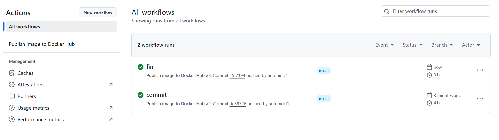
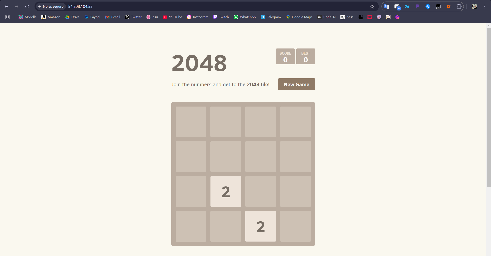

# Practica-5.4 Dockerizar web estática y publicarla en Docker Hub

## 1 - Crear archivo dockerfile con la información siguiente:
```bash
FROM nginx:latest

LABEL AUTHOR="ANTONIO"
LABEL DESCRIPTION="2048"

RUN apt-get update \
    && apt-get install -y git \
    && rm -rf /var/lib/apt/lists/*

RUN git clone https://github.com/josejuansanchez/2048.git /app \
    && cp -R /app/* /usr/share/nginx/html/

EXPOSE 80

CMD ["nginx", "-g", "daemon off;"]
```

## 2 - Ejecutar el archivo dockerfile con el siguiente comando:
```bash
docker build -t antoniocl1/2048 .
```

## 3 - Conseguir un token para poder iniciar sesión en Docker Hub desde Visual Studio.


## 4 - Ahora debemos iniciar sesión en Docker Hub.

```bash
docker login -u antoniocl1 # Pegaremos el token generado en el paso anterior.
```

## 5 - Publicar a Docker Hub

```bash
docker run -d -p 80:80 antoniocl1/2048
docker push antoniocl1/2048:latest
```

## 6 - Asignar una etiqueta a la imagen
Aunque no es obligatorio sería una buena idea etiquetar nuestras imagenes.
```bash
docker tag antoniocl1/2048 antoniocl1/2048:1.0
docker push antoniocl1/2048:1.0
```


## 7 - Publicar imagen en Docker Hub usando Github Actions
Debemos tener sincronizado Github con Docker Hub para empezar, después debemos de crear 2 "Secrets" en nuestro repo para las Github Actions, (creo que con el nombre de cada secreto se entiende para lo que sirve cada uno de ellos), deben de quedar así:
- DOCKERHUB_USERNAME= antoniocl1
- DOCKERHUB_TOKEN= Mi token creado en el paso 3
Esto lo hacemos dentro de nuestro repo, en el apartado de "Settings", vamos a "Secrets and variables" y específicamente a "Actions".
  

## 8 - Creación del nuevo Workflow
Debemos dirigirnos dentro de nuestro repo al apartado de "Actions"

Ahora tenemos que crear uno nuevo y cuando lleguemos a ese apartado le damos a "Setup a workflow yourself", o en español que lo hagas tú mismo :P.

Aquí debemos crear el archivo al que llamaremos "publish-to-docker-hub.yml" y le meteremos el contenido que encontramos en el repo del profesor.

## 9 - Comprobar
 **Salida de ejecución de docker-compose y comprobación con docker-images**




